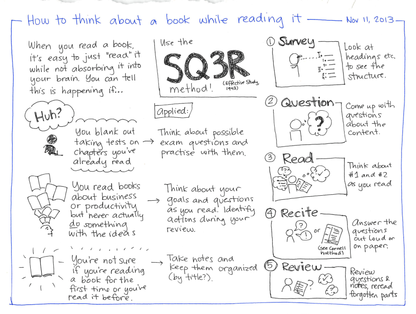

# Active Reading Practices

Pretty much everyone "knows" how to read, right? Pick up the book or article, point your eyes at the words, and occasionally flip the page or scroll down on the screen.

Countless research studies have shown that successful academic reading, however, requires active reading. In a sense, you must engage in dialogue with the text. (If anyone tells you otherwise, they were probably in a state of flow and did not recognize that they were tacitly engaging in dialogue with the text.) There are a number of strategies for actively engaging with text, but the **SQ3R** method, first published in 1943, is pretty much as good as any for reading academic texts.

SQ3R involves five steps:

1. **Survey**,
2. **Question**,
3. **Read** (notice that "read" is the middle step!),
4. **Recite**, and
5. **Review**.

The graphic representation below is an excellent visualization of the strategy in a good amount of detail.

*Source:* [https://flic.kr/p/kuYNYc](https://flic.kr/p/kuYNYc)

See [Read more effectively by asking yourself questions while you read](http://sachachua.com/blog/2013/12/read-effectively-asking-questions-read/) for more information.