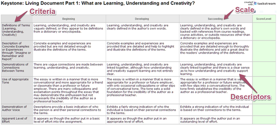
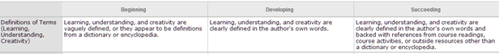

# Reading a Rubric

I will be evaluating your performances of understanding using rubrics, which are available to you through the "Project Packages" I will distribute with each project, as well as on TaskStream. Learning to translate what is in the rubric to an artifact (project, essay, etc.) is an important skill.

According to [Wikipedia](https://en.wikipedia.org/wiki/Rubric_(academic):

>A scoring rubric is an attempt to communicate expectations of quality around a task. In many cases, scoring rubrics are used to delineate consistent criteria for grading. Because the criteria are public, a scoring rubric allows teachers and students alike to evaluate criteria, which can be complex and subjective. A scoring rubric can also provide a basis for self-evaluation, reflection, and peer review. It is aimed at accurate and fair assessment, fostering understanding, and indicating a way to proceed with subsequent learning/teaching. This integration of performance and feedback is called ongoing assessment...

Rubrics are composed of three main parts: criteria, scale, and descriptors (see the image below, a screen shot of a rubric). The *criteria* are those things I will be looking for when reading your essays or going through your projects. The *scale* is the range of levels that I will use to guide my evaluation. Most rubrics (if not all) in this course will use a three-point scale: Beginning, Developing, and Succeeding. I have chosen this scale because I believe that coursework is an ongoing process over time. Lastly, the *descriptors* are the kinds of evidence I will be looking for in your work.

In order to make the translation from rubric to figuring out how to structure your work, let's take the first criterion from the example rubric, "Definitions of Terms:"

Read through the descriptors for each level on the scale. Notice that for "Beginning," the descriptors indicate two possibilities: the definitions are vaguely defined or they look like they've been copied from a dictionary or encyclopedia. You may use these definitions as a starting point to help you come up with your own definitions, but copying and pasting these definitions indicates that you are just beginning on your quest to define learning, understanding, and creativity in a personally meaningful way that you can use in your own educational practice.

Now note that there is something in common between "Developing" and "Succeeding," that the terms are "defined in the author's own words." You now know that an important task to accomplish in your essay is to use your own words in the definition, and to be clear in your words. Moving forward, notice that for "Succeeding," your writing is expected to draw on references to course readings or course activities, and you are welcome to use resources from outside the course (although it's not necessary, and it should be something other than a dictionary or encyclopedia). To demonstrate that you are really succeeding, bring in a reference from the readings or something we've done or discussed in class.

There is logic to the trajectory from Beginning to Developing to Succeeding. A beginning-level performance would not involve high levels of critical thinking and synthesis, so the definitions might be vaguely defined or copied from a source such as a dictionary. A developing performance would involve more critical thinking, so that the definitions are more clearly defined and in the author's own words; the author owns those definitions. Lastly, full success would involve not only critical thinking, but also synthesis: bring together different sources such as course readings, course discussions and activities, or outside resources. This is real success in developing meaningful definitions: writing them up in your own words while connecting your definitions with others' ideas, perspectives, and approaches.

Move through each of the criteria and then sit down and complete the performance. When you have finished creating and writing, run through the criteria again to make sure that you've hit all the criteria.